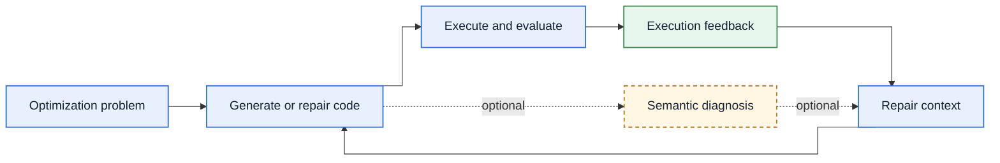
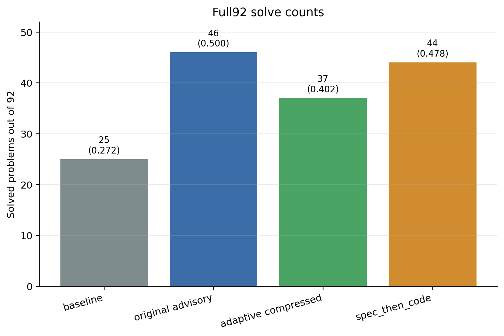

# Semantic Feedback for LLM Optimization Code Repair

Diagnosing and repairing executable-but-wrong Python/Gurobi optimization formulations with LLM semantic feedback.

**Final report:** [Read the complete final report (PDF)](final-report.pdf) for the full methodology, result tables, and evaluation analysis.

Python | Gurobi | LLM-based code repair | Semantic feedback | LogiOR evaluation

## At a Glance

- **Problem:** executable Python/Gurobi code can still encode the wrong optimization formulation.
- **Contribution:** semantic diagnosis is passed into iterative code repair as additional feedback context.
- **Evaluation:** retained, protocol-labelled 92-problem LogiOR results cover execution-only, advisory, adaptive, and specification-first strategies.
- **Reproducibility:** public unit tests and an offline synthetic dry run are available; full experiments require external data, Gurobi, and API credentials.

## Problem

LLMs can generate Python/Gurobi code that runs successfully but encodes the wrong mathematical optimization model. Execution feedback can catch syntax errors, runtime errors, solver failures, and objective mismatches, but it often cannot explain which variable, constraint, flow relation, or objective term is semantically wrong.

## Approach

This project studies semantic diagnosis as repair context. A separate advisor model reads the original problem and candidate code, identifies likely formulation errors, and passes that diagnosis into the next repair prompt. The advisor does not serve as a formal verifier and does not prove correctness.



In the specification-first variant, the system drafts a formulation plan before the initial code-generation step.

*Core semantic-feedback repair loop. Dashed elements are optional method variants.*

Candidate code is executed and analyzed. An advisor identifies likely formulation-level errors, and its diagnosis becomes repair context for the next iteration.

## Methods Compared

The final public [configs](configs/final/) compare four repair strategies:

| Config | Method |
| --- | --- |
| [`baseline_exec_only.yaml`](configs/final/baseline_exec_only.yaml) | Execution-only repair baseline |
| [`advisory_diagnosis_only_gpt5_short.yaml`](configs/final/advisory_diagnosis_only_gpt5_short.yaml) | Direct semantic advisory |
| [`advisory_diagnosis_only_gpt5_short_adaptive_compressed.yaml`](configs/final/advisory_diagnosis_only_gpt5_short_adaptive_compressed.yaml) | Adaptive compressed advisory |
| [`spec_then_code.yaml`](configs/final/spec_then_code.yaml) | Formulation spec before code generation |

A separate cross-difficulty study in the final report evaluates semantic advisory across generator/advisor capability and problem difficulty.

## Results

The complete results, protocols, and analysis are in the [final report](final-report.pdf). The retained, protocol-labelled summaries live in [release_results/](release_results/), including [final_results.md](release_results/final_results.md); raw run directories are excluded.

### Experiment 1: Cross-Difficulty Semantic Advisory Study

Protocol: LogiOR, 92 problems, four difficulty bands, five-round repair horizon.

| Setting | Solved |
| --- | ---: |
| `gpt-4o-mini` execution-only | 31/92 |
| `gpt-4o-mini` + `gpt-5-mini` advisory | 56/92 |
| `gpt-5-mini` execution-only | 53/92 |
| `gpt-5-mini` + `gpt-5-mini` advisory | 53/92 |
| `gpt-5-mini` + `kimi-k2.6` advisory | 54/92 |

### Experiment 2: Final Four-Method Comparison

Protocol: LogiOR, 92 problems, two-round repair horizon.

| Method | Solved | Pass rate |
| --- | ---: | ---: |
| Execution-only baseline | 25/92 | 0.272 |
| Direct semantic advisory | 46/92 | 0.500 |
| Adaptive compressed advisory | 37/92 | 0.402 |
| `spec_then_code` | 44/92 | 0.478 |

These protocols are different and should not be merged into one leaderboard.



*Experiment 2 only: final four-method comparison on 92 LogiOR problems with a two-round repair horizon. It is not a combined leaderboard with the five-round cross-difficulty study above.*

## Key Engineering Contributions

- **Configuration-driven strategies:** [`scripts/run_pilot.py`](scripts/run_pilot.py) runs the public repair strategies defined in [configs/final/](configs/final/).
- **Standalone dataset interface:** the public [src/](src/) code accepts `LOGIOR_DATASET_ROOT` or `--dataset-root` without depending on the original parent repository layout; see [data/README.md](data/README.md).
- **Offline release check:** [`configs/smoke/offline_synthetic.yaml`](configs/smoke/offline_synthetic.yaml) supports a synthetic `--dry-run` path without Gurobi, benchmark data, or model API calls.
- **Curated public evidence:** [tests/](tests/) and [release_results/](release_results/) retain a focused test suite and human-readable evidence snapshot while excluding raw outputs and credentials.

## Repository Layout

```text
.
├── README.md
├── LICENSE
├── final-report.pdf
├── .env.example
├── requirements.txt
├── src/
├── scripts/
├── configs/
│   ├── final/
│   └── smoke/
├── tests/
├── release_results/
│   ├── README.md
│   ├── final_results.md
│   └── figures/
└── data/
    └── README.md
```

## Quick Start On Ubuntu / WSL

Release validation used Python 3.10.12 on WSL Ubuntu 22.04. The validation host did not have the `python3.10-venv` system package, so the standard `python3 -m venv` command was not exercised there. Install the Ubuntu venv package before using that command:

```bash
sudo apt update
sudo apt install -y python3 python3-pip python3-venv python3-dev build-essential

# If your Python 3.10 interpreter still reports that venv is unavailable:
sudo apt install -y python3.10-venv

git clone https://github.com/niu1298/semantic-feedback-for-llm-generated-optimization-code-repair.git
cd semantic-feedback-for-llm-generated-optimization-code-repair

python3 -m venv .venv
source .venv/bin/activate
python -m pip install --upgrade pip
python -m pip install -r requirements.txt

python -m pytest tests -q
```

If installing the system venv package is not possible, use the fallback exercised during release validation:

```bash
python3 -m pip install --user virtualenv
python3 -m virtualenv .venv
source .venv/bin/activate
python -m pip install --upgrade pip
python -m pip install -r requirements.txt
```

## Offline Tests Versus Full Experiments

Offline/unit-test functionality:

```bash
python -m pytest tests -q
python scripts/run_pilot.py --config configs/smoke/offline_synthetic.yaml --dry-run
```

The offline smoke command writes placeholder output under `outputs/smoke/`. It does not call an LLM, run Gurobi, or require LogiOR data.

Local solver-backed and full benchmark runs require additional setup. Do not expect the final experiment to run without Gurobi, external benchmark data, and API credentials.

## Dataset And Gurobi Setup

The LogiOR benchmark data is not included. See [data/README.md](data/README.md) for access and licensing guidance, then provide a local dataset path with either:

```bash
export LOGIOR_DATASET_ROOT=/absolute/path/to/LogiOR
```

or:

```bash
python scripts/run_pilot.py --config configs/final/baseline_exec_only.yaml --dataset-root /absolute/path/to/LogiOR
```

The adapter accepts a directory containing `prob_*` folders directly, or an ORThought-style layout such as `datasets/processed/LogiOR` plus optional `datasets/summary/summary_logior.json`.

Install and license Gurobi locally for solver-backed integration runs. If Gurobi does not find a license automatically, set:

```bash
export GRB_LICENSE_FILE=/absolute/path/to/gurobi.lic
```

Full LLM experiments also require local API credentials, for example:

```bash
cp .env.example .env
# edit .env locally; never commit real keys
```

## Reproducibility

The final comparison [configs](configs/final/) are configured for LogiOR, 92 problems, masked expected objectives, and a two-round repair horizon.

Example full API-backed command after credentials, Gurobi, and data are configured:

```bash
python scripts/run_pilot.py --config configs/final/advisory_diagnosis_only_gpt5_short.yaml
```

Raw outputs are intentionally excluded from Git. Generated runs should go under `outputs/`, which is ignored.

## Limitations

Semantic advisory can improve repair context, but it is not formal verification. The method can still miss constraints, hallucinate diagnoses, over-constrain repairs, or depend on model capability. Results also depend on benchmark access, model availability, Gurobi behavior, API latency, and prompt budgets.

## Final Report

[Read the complete final report (PDF)](final-report.pdf).

## Course Provenance

This repository was originally developed as an MIT MAS.S60 / 6.S985 Multimodal AI 2026 final course project and then prepared as a standalone public code release.